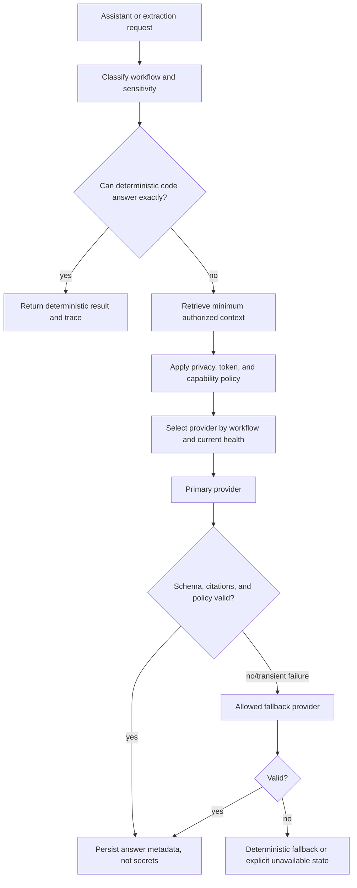

# DueSoon Master Completion Plan

**Status:** Active execution plan
**Date:** 2026-08-31
**Repository baseline:** `f7ee36a` on `main` and `origin/main`
**Foundation:** `DUESOON_CODEX_CONTEXT.md`
**Governing decisions:** `docs/architecture/0001-0007`
**Supersedes for execution tracking:** `docs/superpowers/plans/2026-08-28-duesoon-core-backend-completion.md`

This plan does not replace the foundational product specification or accepted architecture decisions. It converts them, the current repository, production observations, owner decisions, and external research into one ordered completion program. Work must continue from the existing implementation; do not restart, re-fork, or replace DueSoon with another project.

## 1. Final Outcome

DueSoon becomes a reliable, evidence-backed academic assistant that:

1. continuously reads the owner's authorized Canvas, Gmail, calendar, and course-document sources;
2. determines the best supported deadline through `effective_due_at` and the safe scheduling deadline through `operational_due_at`;
3. knows whether Canvas work is complete before displaying or reminding about it;
4. separates deadline danger from what the owner should work on next;
5. learns effort and planning preferences from reviewable outcomes without inventing facts;
6. answers open-ended questions through a general-purpose, school-specialized assistant;
7. shows sources, assumptions, calculations, confidence, and changes without exposing private chain-of-thought;
8. sends daily briefings and checkpoint notifications through private ntfy without duplicates or stale submission alerts;
9. runs as one secure, observable Azure service with one scheduler and persistent SQLite storage; and
10. presents all of this through a coherent DueSoon interface built from retained Odysseus UI resources.

## 2. Product Rules That Do Not Change

- Raw Canvas `due_at` never directly owns reminders or planning. Resolution produces `effective_due_at`; safety-sensitive scheduling uses `operational_due_at`.
- Evidence is versioned and append-only. A current projection may change, but its history is not erased.
- AI interprets, extracts, matches, estimates, retrieves, and explains. Deterministic code validates outputs and owns deadlines, scores, status transitions, reminders, writes, and authorization.
- Every live reminder immediately rechecks the Canvas submission state. Failure to recheck suppresses or retries; it never guesses.
- Checkpoint crossing, deadline versions, database deduplication, catch-up limits, dry-run behavior, and audit records remain mandatory.
- Urgency and work priority remain separate. Urgency controls deadline escalation. Work priority answers what should start now.
- External academic integrations remain read-only unless a future write action is separately designed, approved, confirmed at execution time, and audited.
- No model learns from another model automatically. Shared learning lives in DueSoon's provider-independent evidence, memory, feedback, and decision tables.
- Odysseus supplies reusable UI code and interaction primitives. It does not dictate DueSoon's composition and its legacy runtime remains inert.
- Caveman is a development-agent communication rule, not the voice of the DueSoon assistant or a product architecture dependency.

## 3. Current Reality at the Baseline

The repository is far beyond the old dashboard MVP, but it is not yet a trustworthy finished product.

| Area | Current evidence | Honest status |
|---|---|---|
| Canvas courses, assignments, submissions | Client, normalization, sync, persistence, API, and focused tests exist | Built; live freshness must be reverified |
| Effective Assignment and deadline resolution | Evidence, matcher, resolver, owner review, and `operational_due_at` exist | Built; real-source calibration remains |
| Urgency and reminders | `urgency-v2`, checkpoints, adaptive reconciliation, daily briefing, deduplication, and recheck code exist | Built; production continuity must be reverified |
| ntfy | Private authenticated adapter and safer transient retry behavior exist | Previously delivered successfully; current end-to-end health must be reverified |
| Canvas Inbox, announcements, modules, pages | Content ingestion and automatic evidence processing exist | Built; coverage and live extraction results must be measured |
| Canvas course files | Bounded PDF/DOCX/HTML/text extraction exists | Partial; direct course-file listing returns HTTP 403 for the owner's school and no complete fallback ladder exists |
| Work priority | Capacity, calendar blocks, course-relative value, effort, and prerequisite pressure exist through `work-priority-v3` | Built mechanically; not yet calibrated or explained well with the owner's live data |
| Capacity learning | Free-form outcome parsing and learned capacity exist | Built; useful confidence requires enough confirmed outcomes |
| Gmail and Google Calendar | Read-only clients, storage, automatic sync, professor verification, and busy blocks exist | Code exists; live OAuth, token lifecycle, source scope, and owner workflow are not accepted yet |
| Assistant | Bounded retrieval, deterministic fallback, model router, decision trace, and reviewable learning exist | Partial; live model provider is unavailable and orchestration is not yet proven on real questions |
| Model provider | One OpenAI-compatible chat-completions adapter with model fallbacks exists | Blocked; the prior OpenAI account has no API quota and an exposed key must be revoked |
| Web UI | Login, shell, dashboard, calendar, assistant, notifications, review, settings, retained tools, and Odysseus assets exist | Not accepted; layout, hierarchy, labels, empty states, and control behavior remain inconsistent |
| Azure deployment | One-VM Compose architecture, managed disk, Caddy, ntfy, and DueSoon runtime exist | Running historically; production commit is not assumed to equal `f7ee36a` until verified |
| Tests | Extensive focused DueSoon tests exist across all major services | Fresh full focused run is required; do not claim green from historical results |
| GitHub Actions | Current `origin/main` checks were green on 2026-09-01, including focused tests, image builds, CodeQL, secret/workflow scans, dependency audit, and container checks; broad inherited pytest/image assumptions remain in workflow definitions | Healthy baseline; realign deliberately without discarding useful green security gates |

## 4. Main Diagnosis

The product currently feels “fake” for four different reasons that must not be conflated:

1. **Live-version drift:** pushed code, deployed code, and cached browser assets have not always matched.
2. **Missing source coverage:** Canvas's direct Files endpoint is forbidden, so syllabus and course-document evidence is incomplete even though the extractor exists.
3. **Provider outage:** the assistant UI exists, but the configured OpenAI API cannot answer model-backed questions without API credit.
4. **Weak presentation of valid uncertainty:** `MONITOR`, empty urgent panels, and low scores can be mathematically valid when dates, effort, or learned capacity are absent, but the UI presents them as unexplained verdicts. That is a product failure even when the arithmetic is correct.

The correction is not a new framework or another rewrite. It is to prove the running baseline, complete source access, install a sustainable provider layer, calibrate using real evidence, and make every dashboard state explain itself.

## 5. Target Architecture

```mermaid
flowchart LR
    Canvas[Canvas assignments, submissions, overrides, Inbox, announcements, modules, pages, files]
    Gmail[Read-only professor Gmail]
    Calendar[Read-only work/calendar busy intervals]
    Notes[Owner Notes, Memory, feedback]

    Canvas --> Capture[Idempotent source capture]
    Gmail --> Capture
    Calendar --> Availability[Privacy-minimized availability]
    Notes --> Capture

    Capture --> Sources[(Immutable SourceRecord versions)]
    Sources --> Extract[Bounded structured extraction]
    Extract --> Claims[(Validated claims)]
    Claims --> Match[Course-scoped entity matching]
    Match --> Review{Confidence and authority gate}
    Review -->|admitted| Evidence[(Assignment evidence)]
    Review -->|ambiguous or high impact| Owner[Review Center]
    Owner --> Evidence

    Evidence --> Resolve[Deterministic deadline and state resolver]
    Resolve --> Effective[(EffectiveAssignment projection)]
    Availability --> Priority[Deterministic work-priority engine]
    Effective --> Urgency[Deterministic urgency engine]
    Effective --> Priority
    Effective --> Reminder[Checkpoint and daily reminder reconciliation]
    Urgency --> Reminder
    Reminder --> Recheck[Immediate Canvas submission recheck]
    Recheck -->|complete| Suppress[Suppress and audit]
    Recheck -->|incomplete| Ntfy[Private ntfy delivery]

    Effective --> Retrieval[Question-specific retrieval]
    Evidence --> Retrieval
    Priority --> Retrieval
    Sources --> Retrieval
    Retrieval --> Assistant[Provider-independent assistant service]
    Assistant --> Providers[Copilot / Z.AI / Groq / Gemini adapters]
    Assistant --> Trace[Evidence-linked decision trace]
```



### 5.1 Provider-independent intelligence



Provider choice affects generation quality and cost. It never owns memory, evidence, deadlines, urgency, priority arithmetic, reminder timing, or protected writes.

## 6. External Research and Adoption Decisions

Only licensed code may be adapted. Unlicensed projects may inspire requirements, never source copying.
The findings below were rechecked against official documentation and repository pages on 2026-08-31; provider plans, quotas, models, and prices must be rechecked before implementation or purchase.

| Source | Finding | DueSoon decision |
|---|---|---|
| [Official Canvas Assignments API](https://developerdocs.instructure.com/services/canvas/resources/assignments) | Student-specific overrides and included submission data are official structured fields | Verify `override_assignment_dates`, `all_dates`, and current-user submission coverage before relying on secondary text |
| [Official Canvas Files API](https://developerdocs.instructure.com/services/canvas/resources/files) | Course, folder, and individual-file endpoints are distinct; a course listing failure does not prove every file path is unavailable | Add safe folder, module-item, individual-ID, and content-link fallbacks instead of declaring all files inaccessible |
| [Official Canvas Modules API](https://developerdocs.instructure.com/services/canvas/resources/modules) | Modules expose item relationships and student-applicable overrides | Use module file/page relationships as authoritative discovery context, not as invented due dates |
| [github/copilot-sdk](https://github.com/github/copilot-sdk) | The SDK is now generally available, MIT licensed, supports Python, and exposes models available to the authenticated account | Build an isolated Copilot adapter and entitlement smoke test; do not grant its general agent runtime unrestricted tools |
| [GitHub Copilot plans](https://docs.github.com/en/copilot/get-started/plans) | Copilot Student is free but currently exposes auto model selection only | Do not promise manual 5.6 Sol/Terra/Luna selection through the student's plan; use `auto` and discover capabilities at runtime |
| [GitHub Copilot OAuth](https://docs.github.com/en/copilot/how-tos/copilot-sdk/setup/github-oauth) | Requests can run on behalf of an authenticated user's Copilot subscription | Prefer user OAuth over embedding a personal CLI session in Azure; verify terms, entitlement, refresh, and revocation first |
| [vishalsachdev/canvas-mcp](https://github.com/vishalsachdev/canvas-mcp) | Mature MIT Canvas client patterns include pagination, retries, privacy filtering, file reading, and explicit write safety | Review narrow client and fixture patterns; do not import the 80+ tool surface or hosted third-party data path |
| [learning-agent-canvas-extension](https://github.com/zijinz456/learning-agent-canvas-extension) | Its four-step fallback discovers files through folders, modules, individual IDs, and links when course listing is blocked | Adapt only server-token-compatible discovery; do not scrape browser cookies or require a logged-in browser session on Azure |
| [schoolbridge](https://github.com/Shoberman2/schoolbridge) | MIT snapshot/diff events cover assignments, due-date changes, grades, announcements, calendar events, modules, files, and feedback | Compare its event coverage with DueSoon's domain-event ledger; retain DueSoon's stronger evidence resolver and priority model |
| [maicampus](https://github.com/darwinsubramaniam/maicampus) | MIT project compares estimated and actual effort and learns planning patterns | DueSoon already implements narrative outcome learning; borrow only useful check-in and estimate-versus-actual UX concepts |
| [canvas-obsidian](https://github.com/mihirargulkar/canvas-obsidian) | Hash-based document caching avoids repeated extraction | DueSoon already has versioned `SourceRecord` hashes; verify reuse before adding anything |
| [canvas-lms-mcp](https://github.com/bruchris/canvas-lms-mcp) and [CanvasAPI](https://github.com/ucfopen/canvasapi) | Broad endpoint coverage and mature Canvas fixtures can expose missing edge cases | Use as references and fixture sources under their licenses; do not replace a working custom client without measured benefit |
| [Z.AI pricing](https://docs.z.ai/guides/overview/pricing) | GLM-4.7-Flash is currently listed with free input and output | Candidate for low-cost extraction and fallback, subject to privacy/retention review and a DueSoon evaluation set |
| [Groq limits](https://console.groq.com/docs/rate-limits) | Free-tier limits currently include GPT-OSS and Qwen models with explicit daily/request caps | Candidate OpenAI-compatible fallback; route by quota headers and never retry a 429 loop |
| [Gemini API pricing](https://ai.google.dev/gemini-api/docs/pricing) | Free API use is available, but free-tier content may be used to improve Google products | Do not send raw academic content on the free tier by default; require explicit owner opt-in or a paid/no-training configuration |
| [Google AI Pro benefits](https://support.google.com/googleone/answer/14534406) | The consumer plan includes Google AI Studio benefits and monthly Google Cloud credit, but product quotas are separate | Treat it as a possible budget source, not proof that the Gemini production API is unlimited or already billed |
| [Cloudflare Workers AI pricing](https://developers.cloudflare.com/workers-ai/platform/pricing/) | A free daily allocation exists, but current frontier GLM models require paid access | Keep as optional future adapter, not the immediate primary path |

Projects without a clear license—including Steadii, Personal Canvas Agent, CanvasBuddy, FTE, and IntelliPlan—remain concept references only. Their source must not be copied.

## 7. Model and Cost Strategy

### 7.1 Correct the earlier assumptions

- ChatGPT Plus does not fund OpenAI API usage.
- Copilot Student does not currently provide manual access to every Copilot model; official plan documentation says auto selection only.
- Models do not transfer learning to one another. DueSoon must supply the same stored memory, evidence, corrections, and retrieval context to every provider.
- “Free” inference is not automatically private or production-stable. Provider retention, training use, quota, and terms are release gates.

### 7.2 Recommended routing, subject to benchmark

1. **Deterministic path:** always first for deadlines, status, arithmetic, reminders, and known dashboard questions.
2. **Interactive primary candidate:** GitHub Copilot SDK using authenticated-user OAuth and `auto`, if an Azure smoke test proves the owner's student entitlement supports this use reliably.
3. **Structured extraction candidate:** Z.AI GLM-4.7-Flash or a Groq-hosted model, whichever wins the privacy-scrubbed extraction evaluation and provider review.
4. **Fallback candidate:** the other of Z.AI/Groq, with independent rate-limit and outage handling.
5. **Optional Gemini:** only after the owner accepts the data-use boundary or a paid/no-training API project is configured.
6. **OpenAI:** disabled until the compromised key is revoked and the owner intentionally funds a new API project; it remains an adapter, not a dependency.

Model names live in settings, not code. Routing is by workflow (`assistant_answer`, `claim_extraction`, `entity_matching`, `effort_estimation`) because the cheapest acceptable model may differ for each task.

### 7.3 Evaluation gate

Create a versioned, privacy-scrubbed set of real-shaped examples for deadline extraction, corrections, assignment matching, workload estimation, general questions, prompt injection, and unsupported-answer detection. Measure schema validity, evidence precision/recall, latency, quota use, and estimated cost. No provider becomes primary from reputation alone.

## 8. Ordered Execution Program

### Phase 0 — Lock reality and close the immediate security hole

Tasks:

- record local commit, origin commit, deployed commit, image digest, migration state, and browser asset version;
- back up the Azure SQLite database and prove the backup can be opened;
- revoke the exposed OpenAI key and remove it from production configuration;
- inspect Git history and logs for any other committed or printed credential material without reproducing secrets;
- run the focused DueSoon test suite, compile check, JavaScript syntax checks, Compose validation, and migration proof;
- capture production health: one scheduler, latest successful Canvas sync, Google state, ntfy delivery state, restart count, disk use, and scheduler lag.

Exit gate:

- one written baseline says exactly what is local, pushed, deployed, enabled, healthy, degraded, and disabled;
- compromised credentials are unusable;
- rollback database and commit are known;
- no feature work begins against an unknown production state.

### Phase 1 — Make the live interface truthful and stable

Tasks:

- deploy `f7ee36a` or the verified successor after backup;
- version static assets and confirm Caddy/browser cache behavior;
- preserve the approved split-panel login and DueSoon dashboard composition while using Odysseus tokens, components, animations, responsive behavior, menus, dialogs, and focus states;
- remove duplicate or misleading controls such as a redundant “Ask DueSoon” navigation action when the home assistant already serves that purpose;
- replace unexplained `MONITOR` labels with an actionable state and reason, such as “Needs deadline,” “Needs effort estimate,” “Start later,” or “Completed”;
- show completed Canvas work crossed out in a bounded recent section, sorted by actual completion/submission time, never mixed into active priority;
- make empty urgent state honest: “No work currently meets urgent criteria,” followed by the next relevant deadline and why it is not urgent;
- ensure all menus, settings, review forms, dialogs, calendar details, loading states, and errors use one component language;
- verify desktop, narrow desktop, and iPhone-size layouts with real data.

Exit gate:

- owner sees the same commit reported by the server and browser;
- no overflow, unstyled control, raw glyph, fake freshness indicator, unexplained score, or dead button remains in primary routes;
- UI does not claim data or model capabilities that are unavailable.

### Phase 2 — Complete Canvas truth and solve the HTTP 403 file gap

Tasks:

- verify assignments request student-applicable override dates and current submission data;
- add a bounded file-discovery ladder:
  1. course files endpoint;
  2. all course folders, then folder files;
  3. module items of type `File`, followed by individual file metadata;
  4. file IDs linked from assignment descriptions, discussions, announcements, syllabus, and pages;
  5. second-pass page scanning for newly discovered links;
- preserve same-origin, redirect, byte, format, archive, page-count, and text-length limits from ADR 0007;
- never steal browser cookies or create an Azure dependency on a logged-in Canvas tab;
- record per-course capability status: direct, fallback, forbidden, missing, or malformed;
- add syllabus and course schedule classification, professor identity proposals, midterm/test/exam detection, and page/file locators;
- add submission feedback and calendar-event change coverage where the Canvas account permits it;
- compare domain events with schoolbridge's event categories and add only missing events that affect DueSoon.

Exit gate:

- a course with direct `/files` HTTP 403 can still discover authorized syllabus/module/linked files when Canvas exposes them through another official endpoint;
- inaccessible content is explicitly reported rather than silently treated as absent;
- repeated sync creates no duplicate source, extraction, claim, event, or model call.

### Phase 3 — Install a sustainable model-provider layer

Tasks:

- split the current OpenAI-compatible adapter behind a provider protocol;
- implement provider health, capabilities, quotas, retry-after, circuit breaking, per-workflow budgets, and server-side configuration;
- build a Copilot SDK proof-of-capability with GitHub OAuth, `auto` model discovery, refresh/revocation, no unrestricted tools, and a hard deterministic fallback;
- add Z.AI and Groq through the compatible adapter after terms/privacy review;
- add Gemini only under the accepted data-use policy;
- expose provider status and quota health without revealing keys, account identifiers, or raw prompts;
- prevent fallback storms: at most one permitted fallback chain per request, no cyclic providers, and no repeat calls for unchanged source versions.

Exit gate:

- at least one model-backed assistant response and one structured extraction work on Azure;
- provider outage, quota exhaustion, invalid schema, and timeout all degrade safely;
- deterministic reminders continue with every provider disabled.

### Phase 4 — Prove the evidence pipeline on the owner's real courses

Tasks:

- process assignment instructions, pages, Inbox, announcements, modules, files, and syllabus text incrementally;
- extract deadline, change, cancellation, optional/required, workload, alias, prerequisite, professor, midterm/test, and submission-instruction claims;
- bound semantic matching to same-course candidates and retain evidence locators;
- calibrate authority, recency, explicit supersession, precision, corroboration, and conflict thresholds against scrubbed real cases;
- surface unresolved claims in Review with exact source type, masked identity, candidate assignment, impact, and required owner choice;
- make every accepted deadline change produce a new deadline version and reminder reconciliation audit;
- verify an uncertain interpretation cannot override a stronger official deadline.

Exit gate:

- at least one real source beyond the Canvas assignment record is visible as evidence;
- a real or scrubbed correction resolves correctly, an ambiguous one remains reviewable, and a malicious instruction remains inert;
- the dashboard can explain what DueSoon believes and why.

### Phase 5 — Turn the assistant into a bounded “Jarvis” experience

Tasks:

- accept arbitrary text instead of scripted question templates;
- plan question-specific retrieval across assignments, submissions, evidence, Gmail, calendar blocks, documents, Notes, Memory, reminders, and outcome history;
- add typed read-only tools for exact queries rather than dumping the whole database into a prompt;
- let the assistant create safe internal proposals—notes, memory candidates, effort feedback, review items, or planning suggestions—but require confirmation for protected changes;
- identify the exact missing connection or evidence when a stronger answer is impossible;
- validate academic citations against retrieved evidence IDs and remove unsupported claims;
- present a concise decision trace: sources consulted, facts used, assumptions, confidence, deterministic calculations, provider/policy versions, and material alternative;
- never expose private chain-of-thought;
- persist conversation summaries and user preferences independently of the chosen model.

Exit gate:

- “What is going on?”, “What should I work on?”, “Did I finish everything?”, a novel school question, and a general safe question all work;
- answers remain useful with the model offline;
- no assistant request can write to Canvas, send email, read secrets, execute shell/code, or bypass Review.

### Phase 6 — Calibrate work priority, capacity, and daily planning

Tasks:

- keep urgency unchanged unless calibration proves a defect; do not force assignments into urgent merely to fill a card;
- populate work priority with real operational deadlines, course-relative value, effort evidence, prerequisites, nearby workload, calendar blocks, and learned capacity;
- collect free-form completion feedback including duration, difficulty, number of questions/modules/pages, interruptions, start/stop pattern, and remaining work;
- learn capacity only after the accepted minimum number of confirmed outcomes; keep exact slack unknown before then;
- treat 6–9 hour work shifts as blocked intervals from the calendar, not proof that all remaining time is school capacity;
- detect tests, quizzes, midterms, finals, projects, discussions, and prerequisites as typed workload signals;
- produce “NOW / NEXT / LATER / NEEDS INFO / COMPLETE” with reasons rather than a bare score;
- ensure daily briefing rechecks every Canvas item, includes a bounded plan, and sends at most once per local date;
- support owner dismissal/snooze only as audited UI state; it must not alter Canvas or hide evidence permanently.

Exit gate:

- a large distant project can outrank a small nearer task when slack proves it should start first;
- completed work is removed from active planning immediately after Canvas confirmation;
- all priority outputs explain missing data instead of inventing hours.

### Phase 7 — Finish Gmail and calendar as focused evidence sources

Tasks:

- complete OAuth callback, CSRF state, refresh, revocation, least-privilege scopes, and protected token storage;
- scope Gmail to configured professor senders, course terms, and bounded date windows rather than cloning an unrestricted mailbox;
- preserve the full Odysseus-derived email-reader interface only where it helps inspect authorized evidence; never add automatic replies;
- let syllabi propose professor identities but require owner verification before high-authority email matching;
- ingest professor corrections, exam dates, workload warnings, attachments, and aliases as evidence;
- import Google Calendar busy intervals for work shifts and appointments while storing hashed event IDs and no titles/descriptions in planning tables;
- keep Apple Calendar deferred unless the owner chooses a safe feed/export or supported API path; do not scrape an iPhone account;
- isolate Google failure from Canvas sync and reminders.

Exit gate:

- a verified professor email can create a reviewable deadline or workload claim;
- a work shift changes availability without becoming an academic deadline;
- disconnect/revoke stops future access while audit history remains intact.

### Phase 8 — Complete retained DueSoon tools and review workflow

Tasks:

- adapt Notes for assignment annotations and evidence notes;
- adapt Memory for aliases, preferences, confirmed capacity facts, professor mappings, and reversible corrections;
- adapt Documents for source status, extraction, provenance, and evidence links;
- complete Review views for academic claims, professor identity, learned preferences, aliases, effort estimates, and protected changes;
- show before/after, impact, evidence, confidence, scope, model/policy version, and Undo;
- remove inherited code only after each retained DueSoon path has characterization tests and a verified replacement;
- keep chats, generic tasks, contacts, CardDAV, CalDAV, broad research, gallery, shell, voice, unrestricted MCP, and model-hosting runtimes inert unless a future DueSoon requirement justifies them.

Exit gate:

- every learned or owner-confirmed change can be found, explained, and reversed;
- no dead inherited route or dangerous generic tool is exposed in production.

### Phase 9 — Align CI, deployment, security, and operations

Tasks:

- replace inherited broad pytest CI with blocking `tests/duesoon` plus compile and JavaScript checks;
- make Docker CI build the actual DueSoon production image and supported `linux/amd64` target first; retain ARM only if it has a real deployment requirement and green native runner;
- keep dependency, secret, workflow, CodeQL, container, and Dockerfile security checks, but label advisory jobs accurately;
- preserve the 2026-09-01 green baseline while replacing inherited broad-test/image assumptions; if a future check fails, diagnose its log rather than hiding it with `continue-on-error` or deleting useful gates;
- add migration-from-prior-schema and backup/restore jobs;
- add versioned static-asset smoke checks and authenticated browser route tests;
- add production verification for health, login, briefing, Canvas age, Google age, extraction queue, scheduler lag, exactly one scheduler, ntfy ACL, and restart count;
- use Azure managed identity plus Key Vault for new long-lived provider/OAuth secrets when practical; until then keep root-owned `0600` secret files and never expose them to browser APIs;
- run security review after the system is functionally stable, then fix or explicitly record accepted findings.

Exit gate:

- required GitHub checks are green for the correct DueSoon product;
- a clean Azure deployment and rollback are documented and rehearsed;
- backup restore, restart recovery, deadline changes, provider outage, and ntfy ambiguous timeout do not duplicate notifications.

### Phase 10 — Production acceptance and observation window

Tasks:

- run at least several real scheduler cycles with live Canvas and provider health observed;
- verify one controlled notification only if the owner authorizes it;
- compare dashboard completion, deadlines, and priorities with Canvas manually for representative courses;
- resolve all high-impact Review items and document accepted low-confidence limitations;
- freeze the release commit, image digest, schema version, provider policy versions, and rollback point;
- update `DUESOON_CODEX_CONTEXT.md` only for genuinely changed invariants and write ADRs for new durable decisions.

Exit gate:

- the owner can trust the dashboard without checking whether it is demo data;
- the assistant, daily plan, evidence, reminders, notification delivery, and recovery path are all proven on the live system;
- remaining work is explicitly optional rather than missing core behavior.

## 9. Test and Verification Matrix

Every behavior change adds focused tests at the responsible layer.

| Risk | Required proof |
|---|---|
| Canvas access | pagination, overrides, submissions, 401/403/404/429/5xx, per-course capability status, and every file fallback |
| Source safety | idempotent hashes, bounded files, redirects denied, archive limits, prompt injection treated as data |
| Matching/resolution | course-scoped candidates, aliases, professor identity, supersession, conflicts, date-only precision, DST |
| Urgency/priority | all boundaries, completed override, cluster windows, earlier-date bonus, effort unknown, capacity unknown, calendar overlap, prerequisites |
| Reminders | all five crossings, first sync, downtime catch-up, deadline versioning, adaptive cap, daily dedup, immediate recheck, ambiguous delivery |
| Assistant | arbitrary questions, deterministic exact answers, provider fallback, quota exhaustion, schema rejection, citation validation, no protected writes |
| Learning | narrative extraction, minimum samples, review-required categories, append-only audit, undo, no oscillating duplicate proposals |
| Gmail/calendar | OAuth state, refresh, revoke, scope, professor filtering, busy-block privacy, auxiliary failure isolation |
| UI | login, all navigation, dialogs, empty/loading/degraded states, desktop/mobile, keyboard/focus, asset version, escaped untrusted content |
| Operations | migration, backup/restore, one scheduler, restart, health projection, container non-root, secret redaction, deployment rollback |

Routine implementation gates:

```text
python -m pytest tests/duesoon -q
python -m compileall -q src/duesoon
node --check on every DueSoon JavaScript module
docker compose config for the production manifest
git diff --check
```

Do not run the quarantined inherited Odysseus suite unless a change intentionally touches its retained behavior.

## 10. Release Discipline

Each phase follows the same sequence:

1. inspect current code and live state;
2. write or update the focused regression proof;
3. make the narrowest compatible change;
4. run the relevant focused tests and full `tests/duesoon` before release;
5. update migrations, ADRs, and operations docs when applicable;
6. commit one coherent phase or safe subphase;
7. push only verified code;
8. back up production before schema/scheduler changes;
9. deploy one version;
10. verify the version and health live;
11. stop and roll back if any core reminder invariant regresses.

Conversation credit limits may shorten progress reports but never justify skipping engineering or leaving an unknown partial deployment. The repository plan and handoff files preserve continuity across models/accounts.

## 11. Explicitly Deferred

- public multi-user signup, billing, and institution administration;
- native iOS/Android or PWA packaging before the web product is stable;
- automatic email replies or Canvas writes;
- Apple Calendar scraping;
- OCR for image-only documents until a bounded privacy/security design exists;
- model fine-tuning before a privacy-scrubbed evaluation set proves value;
- unrestricted web, shell, filesystem, coding, MCP, or general agent tools;
- Twilio unless ntfy reliability proves inadequate and the owner accepts its cost;
- horizontal application scaling while SQLite and an in-process scheduler remain active.

## 12. Definition of Complete

DueSoon is complete for the current single-owner release only when:

- production runs the documented release and shows its version;
- Canvas assignments, student-specific deadlines, submissions, communications, modules, pages, and accessible documents synchronize idempotently;
- the course-file 403 produces safe fallback discovery or an explicit per-source limitation;
- every displayed deadline and reminder points to `effective_due_at`/`operational_due_at` and evidence;
- completed Canvas work is crossed out/recently completed and never appears as active urgent work;
- urgency, work priority, capacity, and daily planning are separate, explainable, and calibrated;
- the assistant accepts arbitrary questions, uses provider-independent memory/evidence, and remains useful without a model;
- at least one sustainable model provider works on Azure and all provider failures degrade safely;
- Gmail and calendar either work under accepted read-only scopes or are honestly marked disconnected without affecting Canvas;
- protected learning changes require Review and all learning can be inspected and undone;
- reminders survive restart, deadline change, downtime, and provider failure without stale or duplicate sends;
- the private ntfy route is authenticated and live delivery is proven exactly once in an authorized test;
- required CI checks, focused tests, migration proof, backup/restore, security review, and live verification pass; and
- the owner can ask “What is going on, what changed, what should I do next, and why?” and receive a real, evidence-linked answer rather than a scripted or decorative response.
