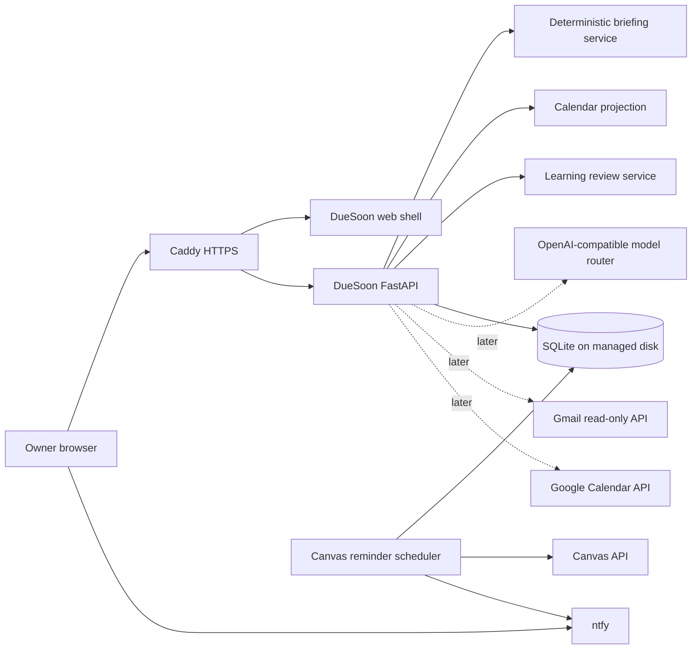

# DueSoon Dashboard Assistant Design

**Status:** Approved product design  
**Date:** 2026-08-27  
**Foundation:** `DUESOON_CODEX_CONTEXT.md`  
**Chosen approach:** Reuse the inherited Odysseus presentation shell in the existing DueSoon FastAPI service while keeping its legacy runtime inert.

## 1. Purpose

DueSoon needs a secure web interface that makes its existing Canvas ingestion and live reminder system understandable and useful. The interface should feel like a focused evolution of Odysseus rather than an unrelated admin panel. It must expose the student's current academic situation, provide a dashboard assistant for questions such as “Any updates?”, and preserve useful inherited ideas without restarting the entire legacy Odysseus backend.

The first production milestone is a complete, stable web experience built on the current single-user Azure deployment. Native apps, public signup, multi-user tenancy, Gmail, Google Calendar, and model-backed reasoning remain explicit later phases. They must not delay or destabilize the first working dashboard.

## 2. Product Decisions

The approved decisions are:

- Keep the current DueSoon FastAPI application as the only active application backend.
- Extract and adapt selected Odysseus interface patterns instead of running its full backend.
- Preserve original inherited source so useful behavior can be revisited later.
- Ship a secure single-owner web interface before considering a PWA or native app.
- Preserve the existing Canvas scheduler and ntfy reminder path during all web work.
- Build the deterministic dashboard and assistant first, then add model-backed answers.
- Use the existing OpenAI-compatible provider through a configurable primary model and ordered fallback models.
- Add Gmail through read-only OAuth in a later phase.
- Make the calendar closely follow Canvas calendar behavior and visual conventions while remaining a DueSoon interface.
- Store AI corrections as reviewable, reversible learning records.
- Never allow AI conclusions to silently alter canonical deadlines, submission state, or reminder timing.
- Run Codex Security review against every security-relevant change before final production approval.

## 3. Goals and Non-Goals

### 3.1 MVP goals

The first release must provide:

1. Secure owner login and session handling.
2. A responsive Odysseus-derived navigation shell.
3. A home briefing using real persisted Canvas data.
4. A Canvas-style academic calendar.
5. A deterministic dashboard assistant that answers common status questions.
6. Notification history and reminder status.
7. A Review Center foundation for future AI learning.
8. A Settings foundation that can later manage model and integration choices.
9. Production deployment on the existing Azure host without interrupting live reminders.

### 3.2 Deferred but required work

The following work is required after the MVP and remains tracked in the foundational context:

- OpenAI-compatible model routing and fallback models.
- AI answer feedback and correction learning.
- Gmail reader and academic evidence extraction.
- Google Calendar overlay and locally created events.
- Notes, memory, and document tools adapted from Odysseus.
- Multi-user architecture hardening before any public launch.
- PWA or native application work only after the web interface is reliable.

### 3.3 Non-goals

The MVP will not run or expose inherited shell execution, model hosting, cookbook, unrestricted research, gallery editing, contacts, CardDAV, CalDAV, generic task automation, TTS, MCP administration, or other broad Odysseus capabilities. Their source may remain preserved, but they are not production routes.

## 4. Chosen Architecture

The DueSoon container will serve both the existing JSON API and a static web application. The web layer directly reuses the inherited Odysseus stylesheet, navigation structure, submenus, theme system, and animated-background modules. It does not load the monolithic legacy application runtime or service worker. Focused DueSoon view modules own all behavior and use authenticated DueSoon APIs.

The scheduler, Canvas client, notification service, and reminder tables remain independent from browser session state. A broken page, model outage, or Gmail outage must not stop reminder evaluation.

## 5. Web Interface

### 5.1 Navigation

The main navigation contains:

- **Home:** academic briefing, urgent work, recent changes, next deadlines, and a prominent assistant input.
- **Assistant:** expanded conversation history, evidence-linked answers, follow-up questions, and feedback controls.
- **Calendar:** Canvas-style month, week, and agenda views with course colors and assignment details.
- **Email:** Gmail reader placeholder in the MVP and live read-only Gmail integration later.
- **Notifications:** sent, suppressed, failed, and upcoming reminder checkpoints.
- **Review:** proposed, approved, rejected, and reverted learned changes.
- **Settings:** security-safe preferences, model order, integration status, reminder preferences, and feature flags.

Notes, Memory, and Documents remain preserved and represented as disabled feature-flagged capabilities until their DueSoon-specific versions are implemented.

### 5.2 Responsive behavior

Desktop uses an Odysseus-style left navigation rail and main workspace. Narrow screens collapse navigation into a compact bottom or drawer control. The first release is a responsive website, not a PWA. No service worker, offline state, install prompt, native wrapper, or app-store packaging is required.

### 5.3 Home briefing

The home screen prioritizes decisions rather than raw record counts:

- work due next;
- urgent and overdue work;
- recently changed deadlines;
- missing versus submitted assignments;
- active reminder checkpoints;
- unresolved questions or conflicts;
- recent notification outcomes; and
- one input for “What is going on?” or similar questions.

Cards link to the assignment, course, calendar date, evidence, or reminder audit record that supports them.

## 6. Calendar

The calendar should match the useful behavior and familiarity of the Canvas calendar without copying Canvas branding. It provides:

- month, week, and agenda views;
- course-specific colors;
- previous, next, and today navigation;
- assignment titles positioned on their due dates;
- overdue, submitted, missing, and graded visual states;
- assignment detail panels with Canvas links;
- timezone-correct display using the configured student timezone; and
- later overlays for read-only Google Calendar events and editable local DueSoon events.

Canvas assignments remain read-only. User interface actions cannot change Canvas due dates or submission states.

## 7. Dashboard Assistant

### 7.1 Deterministic briefing service

The MVP assistant is backed by a deterministic briefing service. It reads persisted courses, assignments, submissions, reminder events, notification deliveries, and scheduler state. It produces a structured snapshot containing:

- current time and timezone;
- urgent, upcoming, overdue, missing, submitted, and graded assignment groups;
- recent sync and deadline changes;
- reminder activity;
- data freshness;
- conflicts and unanswered questions; and
- links to supporting records.

Common requests such as “Any updates?”, “What is due next?”, “What am I missing?”, and “Did I submit everything?” receive deterministic answers even when no model provider is configured.

### 7.2 Model-backed answers

After the MVP is stable, the assistant may send the structured snapshot, the user's question, and minimal supporting excerpts to an OpenAI-compatible provider. It must not give the model unrestricted database, filesystem, secret, network, or tool access.

Settings define:

- provider base URL;
- primary model;
- ordered fallback models;
- per-model input and output token limits;
- optional cost limits; and
- timeout behavior.

Fallback occurs only for rate limits, timeouts, availability failures, and configured provider errors. A low-quality answer does not silently trigger a second costly model call.

### 7.3 Confidence behavior

The assistant distinguishes evidence confidence from relative answer dominance:

- Strong evidence produces a direct answer.
- If one supported interpretation clearly dominates much weaker alternatives, the assistant may answer with “likely,” identify the evidence, and offer correction.
- If competing interpretations are close or no evidence exists, the assistant asks a targeted question.
- Assistant uncertainty never blocks or changes deterministic reminders.

The user may always inspect the evidence behind an answer.

## 8. Learning and Review Center

When the user marks an answer wrong, the assistant asks what was wrong and requests the minimum information needed to learn. The resulting proposal stores:

- the original answer or interpretation;
- the correction;
- the user's explanation;
- supporting source references;
- proposed scope: assignment, course, sender, or global;
- affected future behavior;
- creator and timestamps;
- approval state; and
- reversal history.

The Review Center shows proposed, approved, rejected, and reverted items. Each item exposes before/after behavior and potential impact. The user can approve, edit, reject, or undo it.

Approved learning may improve assistant phrasing, assignment aliases, professor identity mappings, source interpretation hints, and future matching suggestions. It cannot directly change canonical deadlines, submission state, or reminder schedules. A canonical change requires separately validated evidence and the deterministic evidence-resolution path defined by the foundational specification.

## 9. Gmail and Google Calendar

Gmail is a later read-only integration using OAuth and the narrowest practical scopes. The interface may display the mailbox, but the evidence pipeline stores only Gmail identifiers, necessary metadata, matched academic content, extracted evidence, and attachment references. Ordinary bodies should be fetched on demand rather than copied into permanent storage.

Google Calendar is also a later read-only integration. Events overlay the Canvas-style calendar. Local DueSoon events may be editable in DueSoon, but automatic writes to Google Calendar are not part of the approved scope.

Provider failures must degrade their own panels without breaking Canvas views, the assistant's deterministic answers, or reminders.

## 10. Authentication and Browser Security

The MVP uses one owner account. Browser authentication is separate from ntfy credentials and separate from API-token automation.

Required controls include:

- a modern password hash;
- a server-side or cryptographically signed session with short, renewable lifetime;
- `HttpOnly`, `Secure`, and appropriate `SameSite` cookies;
- CSRF protection for state-changing browser requests;
- login throttling and generic failure messages;
- session invalidation on logout and password rotation;
- no secrets in browser storage;
- authorization on every protected page and API endpoint;
- secure response headers and HTTPS; and
- output encoding and sanitization for untrusted Canvas, email, and model content.

The existing API token remains available for controlled automation endpoints. It must never be embedded into frontend JavaScript or HTML.

## 11. Routing and ntfy Compatibility

Caddy will send the dashboard, login, static assets, health routes, and DueSoon API routes to the DueSoon container. ntfy topic, subscription, and publishing paths required by the iPhone application remain routed to ntfy. The ntfy web landing page may be displaced by the dashboard, but the configured iPhone subscription and notification delivery must continue working.

The current Azure hostname remains acceptable during web development. Custom domains, PWA packaging, and native app delivery are deferred.

## 12. Error Handling and Observability

Each panel reports freshness and degraded state without exposing secrets. The application must distinguish:

- Canvas unavailable or credentials invalid;
- stale local data;
- scheduler failure;
- model provider unavailable or rate-limited;
- Gmail or Google OAuth disconnected;
- notification provider failure; and
- browser session expiry.

Logs contain event types, safe identifiers, counts, durations, and error codes. They must not contain tokens, passwords, full email bodies, assistant prompts containing sensitive content, or unredacted academic records.

## 13. Delivery Phases

### Phase A — Guaranteed web MVP

Implement and deploy owner login, web shell, real Canvas home briefing, Canvas-style calendar, deterministic assistant, notification history, Review Center foundation, and Settings foundation. Preserve live reminders.

### Phase B — Model assistant

Add OpenAI-compatible provider configuration, model selection, ordered fallbacks, evidence-linked responses, rate-limit handling, and bounded token/cost controls.

### Phase C — Learning

Add assistant feedback questions, durable learning proposals, Review Center approval/edit/reject/undo behavior, and scoped application of approved learning.

### Phase D — Gmail evidence

Add read-only Gmail OAuth, mailbox reader, minimal cache, academic matching, attachments, and evidence extraction.

### Phase E — Calendar and retained tools

Add read-only Google Calendar overlay, local events, then adapt Notes, Memory, and Documents. Do not activate inherited tools until their DueSoon replacement is verified.

### Phase F — Application delivery

Consider PWA or native delivery only after the web interface is stable, secure, and useful.

Every phase ends with tests, a focused security review, a commit, a push, an Azure deployment, and runtime verification. If implementation credits become constrained, complete and deploy the current phase in a clean state, record remaining work, and do not leave production partially migrated.

## 14. Testing

The web program requires:

- unit tests for briefing classification and assistant deterministic answers;
- API authorization and CSRF tests;
- login throttling, cookie, logout, and session-expiry tests;
- calendar projection and timezone-boundary tests;
- notification-history authorization and redaction tests;
- learning proposal lifecycle and undo tests;
- model routing, fallback, timeout, rate-limit, and token-cap tests;
- Gmail and Google Calendar OAuth/state/scope tests when added;
- frontend smoke tests for navigation, empty, loading, degraded, and populated states;
- responsive browser checks for desktop and iPhone-sized viewports;
- full regression tests for Canvas sync and reminders; and
- Azure health, login, dashboard data, scheduler, and ntfy delivery checks.

## 15. Codex Security Gate

Before production approval, run Codex Security review against the completed change set. At minimum, review:

- authentication, session, CSRF, and authorization boundaries;
- API-token separation;
- Caddy routing and ntfy path isolation;
- secret loading and redaction;
- HTML/model/email content sanitization;
- prompt injection and model tool isolation;
- Gmail and Google OAuth scopes, token storage, callback validation, and state handling;
- learning proposal authorization and audit integrity;
- database queries and object ownership;
- dependency and container changes;
- log, error, backup, and browser-cache exposure; and
- preservation of the immediate Canvas submission recheck, deduplication, and single scheduler.

Security findings must be triaged and fixed or explicitly accepted by the owner before final production approval. Security review supplements normal tests; it does not replace them.

## 16. MVP Definition of Done

The dashboard MVP is complete only when:

1. The Azure URL presents a secure login and authenticated DueSoon interface.
2. Home displays real, current Canvas-derived academic state.
3. Calendar provides working month, week, and agenda views with course colors and assignment status.
4. The deterministic assistant correctly answers the supported status questions with links to evidence.
5. Notifications show persisted reminder and delivery outcomes without exposing message secrets.
6. Review and Settings foundations render safely and clearly mark unavailable future functions.
7. Existing Canvas synchronization and reminder checkpoints continue running with no duplicate sends or submission-recheck regression.
8. Desktop and iPhone-sized browser layouts work.
9. Unit, integration, frontend smoke, security, and Azure runtime checks pass.
10. The branch is committed and pushed, Azure is healthy, deferred phases remain documented, and rollback information is available.

## 17. Agent Communication Architecture

DueSoon agents use the installed `caveman` skill for user-facing conversation by default. This reduces credit use by compressing progress updates, explanations, and handoffs without reducing technical substance. The mode remains active until the owner explicitly requests `stop caveman` or `normal mode`.

This communication rule does not change application behavior or engineering standards. Code, tests, comments, commits, specifications, handoffs, security warnings, and destructive-action confirmations remain clear normal prose. Agents must never trade implementation, testing, verification, or safety for shorter communication.
